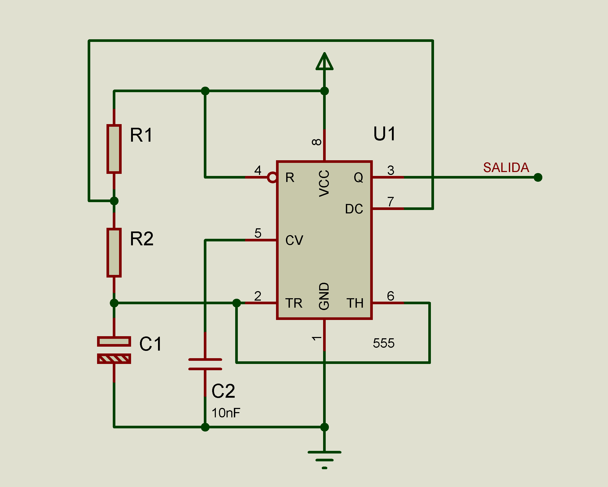
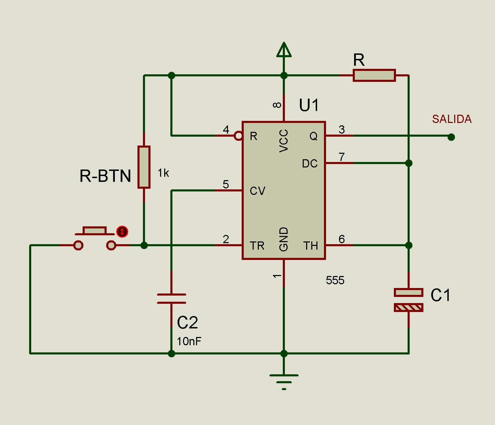

# Configuraciones básicas IC 555
## Configuración Astable
La señal de salida tiene un nivel Alto por un tiempo **Ta** y un nivel Bajo por un tiempo **Tb**.

**Diagrama Conexión:**

## Configuración Monoestable
Entrega a su salida un solo pulso Ta de un ancho de banda especificado por el diseñador.

**Diagrama Conexión:**

> En el **pdf** encontraras las formulas necesarias para calcular las resistencias para las configuraciones **en base a la variación del capacitor**