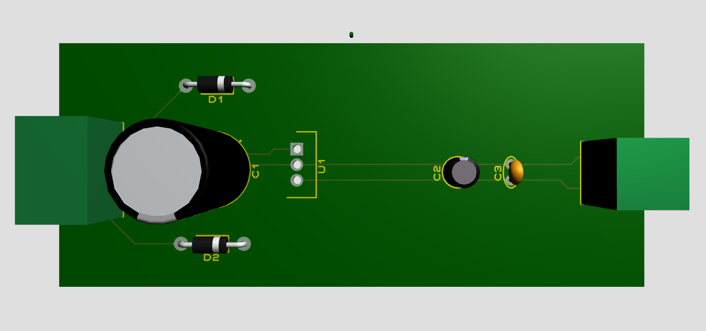

# Fuente de poder 5V 1A

> Idea para proyectos de bajo consumo

## Materiales

* 1 LM7805: Regulador de tensión
* 1 Transformador AC a DC 9 o 12 voltios 
* 2 Diodos 1N4001
* 1 Capacitor 2200uF (Electrolítico Radial)
* 1 Capacitor 1uF (Electrolítico Radial)
* 1 Capacitor 1nF (Cerámico)
* 1 socket de 3 pines para salida de transformador
* 1 socket de 2 pines para la salida 5v, 1A

> En el pin 1 colocar positivos
>
> En el pin 2 neutral
>
> En el pin 3 negativo

## Preview

**Esquema** **Eléctrico**

**Diseño PCB**

**Vista 3D**

