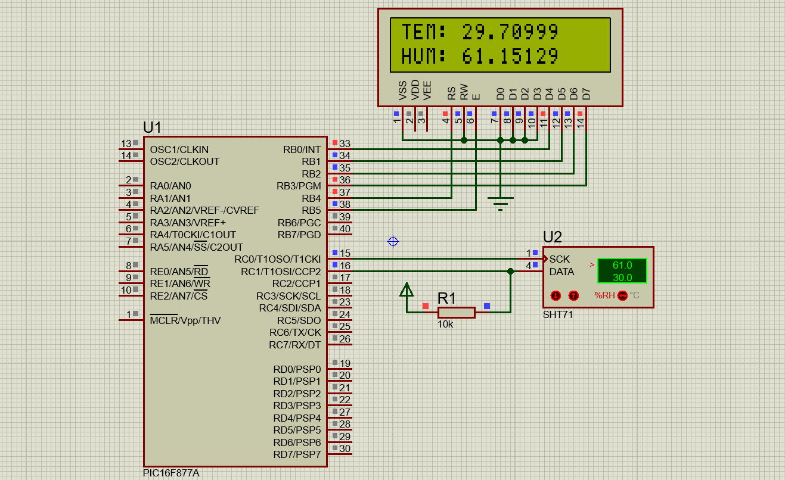

# Sensor de temperatura y humedad con SHT71 y PIC16F877A

## Listado de Materiales:
* PIC16F877A
* Sensor de Humedad-Temperatura SHT71
* Cristal 10 Mhz
* Resistencia 10k para el sensor
* LCD

**Compila el archivo .c con mikroC para obtener el .HEX y quemarlo en el microcontrolador**

